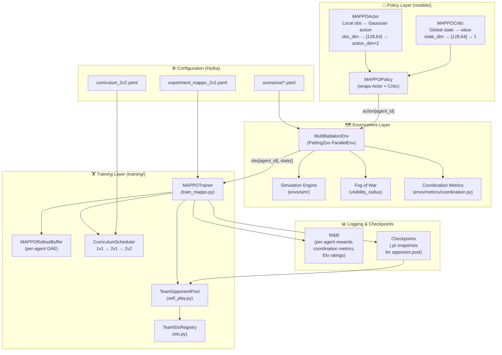
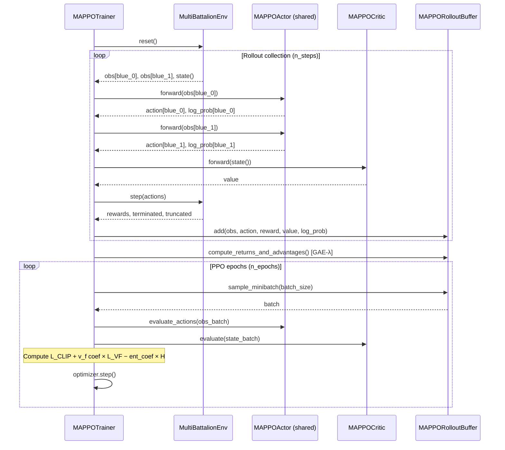

# v2 System Architecture

This document describes the v2 multi-agent system architecture for
wargames_training.  The v2 system implements Multi-Agent Proximal Policy
Optimization (MAPPO) with Centralized Training, Decentralized Execution
(CTDE) for NvN battalion combat.

---

## High-Level Component Diagram



---

## Data Flow: Single Training Step



---

## Observation & State Tensors

```
Per-Agent Local Observation (obs_dim = 6 + 5*(n_total-1) + 1)
┌──────────────────────────────────────────────────────────────┐
│ Self state (6)   │ x/W │ y/H │ cos θ │ sin θ │ hp │ morale  │
├──────────────────────────────────────────────────────────────┤
│ Other units      │ For each of (n_total - 1) other units:   │
│ (5 per unit)     │ Δx/W │ Δy/H │ cos θ │ sin θ │ hp         │
│                  │ (zeroed if outside visibility_radius)     │
├──────────────────────────────────────────────────────────────┤
│ Terrain (1)      │ cover value at agent position [0, 1]     │
└──────────────────────────────────────────────────────────────┘

Global State for Centralized Critic (state_dim = 6*n_total + 1)
┌──────────────────────────────────────────────────────────────┐
│ All units (6 per unit, unobscured, ordered Blue then Red)   │
│  x/W │ y/H │ cos θ │ sin θ │ hp │ morale                   │
├──────────────────────────────────────────────────────────────┤
│ Step (1)  │ normalized step count [0, 1]                    │
└──────────────────────────────────────────────────────────────┘
```

---

## Curriculum Stages

```
┌─────────────────────────────────────────────────────────────┐
│  Stage 1 — 1v1                                              │
│  Env: BattalionEnv (v1)                                     │
│  Policy: PPO (or MAPPO with n_blue=1)                       │
│  Opponent: scripted Red (curriculum levels 1–5)             │
│                                                             │
│  Promote when: rolling win-rate ≥ 70% over 100 episodes     │
└───────────────────────┬─────────────────────────────────────┘
                        │  load_v1_weights_into_mappo()
                        ▼
┌─────────────────────────────────────────────────────────────┐
│  Stage 2 — 2v1                                              │
│  Env: MultiBattalionEnv (n_blue=2, n_red=1)                 │
│  Policy: MAPPO (shared actor)                               │
│  Opponent: stationary Red                                   │
│                                                             │
│  Promote when: rolling win-rate ≥ 70% over 100 episodes     │
└───────────────────────┬─────────────────────────────────────┘
                        │
                        ▼
┌─────────────────────────────────────────────────────────────┐
│  Stage 3 — 2v2                                              │
│  Env: MultiBattalionEnv (n_blue=2, n_red=2)                 │
│  Policy: MAPPO (shared actor)                               │
│  Opponent: scripted Red → self-play pool                    │
└─────────────────────────────────────────────────────────────┘
```

---

## Self-Play Loop

```
┌───────────────────────────────────────────────────────────┐
│                     TeamOpponentPool                      │
│                                                           │
│   Snapshot archive (up to pool_max_size .pt files)        │
│   ┌──────┐  ┌──────┐  ┌──────┐  ...  ┌──────┐           │
│   │ 50k  │  │ 100k │  │ 150k │       │ Nk   │ ← latest  │
│   └──────┘  └──────┘  └──────┘       └──────┘           │
│                                                           │
│   Sampling: uniform (or Elo-weighted when enabled)        │
└───────────────────┬───────────────────────────────────────┘
                    │ sample opponent
                    ▼
          ┌──────────────────┐        ┌──────────────────┐
          │  Blue (MAPPO)    │◄──────►│  Red (snapshot)  │
          │  current policy  │ battle │  frozen policy   │
          └────────┬─────────┘        └──────────────────┘
                   │ episode result
                   ▼
          ┌──────────────────┐
          │  TeamEloRegistry │ ← updates Elo ratings
          └──────────────────┘
                   │ every snapshot_freq steps
                   ▼
          ┌──────────────────┐
          │ Save snapshot to │
          │ opponent pool    │
          └──────────────────┘
```

---

## File Map

```
wargames_training/
├── envs/
│   ├── multi_battalion_env.py    # PettingZoo ParallelEnv (NvN)
│   ├── battalion_env.py          # Gymnasium 1v1 env (v1, used in curriculum)
│   ├── metrics/
│   │   └── coordination.py       # flanking_ratio, fire_concentration, mutual_support
│   └── sim/
│       ├── battalion.py          # Battalion state, movement, morale
│       ├── combat.py             # Fire resolution, damage, routing
│       ├── engine.py             # Step orchestration
│       └── terrain.py            # Terrain cover and elevation
├── models/
│   ├── mappo_policy.py           # MAPPOActor, MAPPOCritic, MAPPOPolicy
│   └── mlp_policy.py             # BattalionMlpPolicy (v1 PPO)
├── training/
│   ├── train_mappo.py            # MAPPOTrainer, MAPPORolloutBuffer, Hydra entry-point
│   ├── curriculum_scheduler.py   # CurriculumScheduler, load_v1_weights_into_mappo
│   ├── self_play.py              # OpponentPool, TeamOpponentPool, TeamEloRegistry
│   ├── elo.py                    # EloRegistry, TeamEloRegistry
│   ├── train.py                  # v1 PPO training pipeline
│   └── evaluate.py               # CLI evaluation script
├── configs/
│   ├── experiment_mappo_2v2.yaml # Reference 2v2 MAPPO experiment
│   ├── curriculum_2v2.yaml       # Three-stage curriculum config
│   └── scenarios/
│       ├── 2v1.yaml
│       ├── 2v2.yaml
│       ├── 3v3.yaml
│       ├── 4v4.yaml
│       └── 6v6.yaml
└── docs/
    ├── multi_agent_guide.md      # MAPPO setup and usage guide (this doc's companion)
    ├── v2_architecture.md        # This document
    └── scaling_notes.md          # NvN dimensionality and performance analysis
```

---

## See Also

- `docs/multi_agent_guide.md` — Step-by-step setup and training guide
- `docs/scaling_notes.md` — NvN scaling analysis
- `docs/ENVIRONMENT_SPEC.md` — Full v1 environment specification
